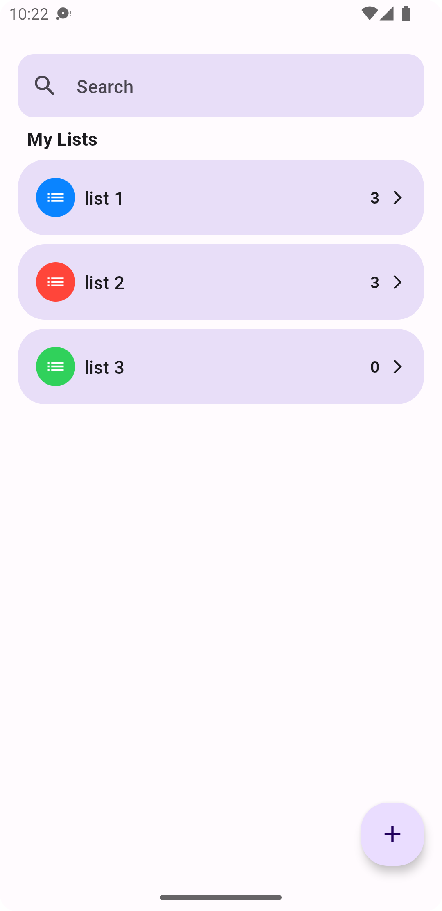
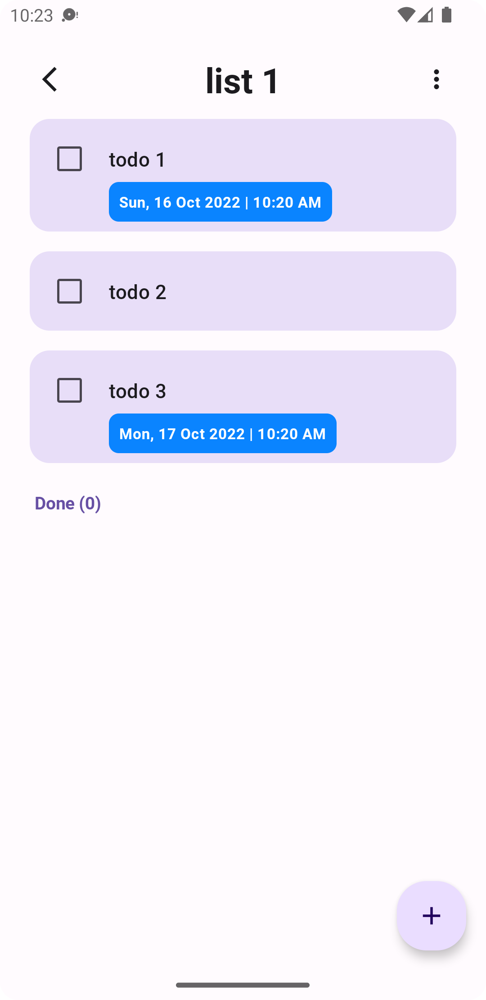
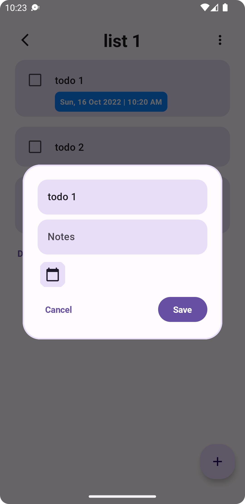
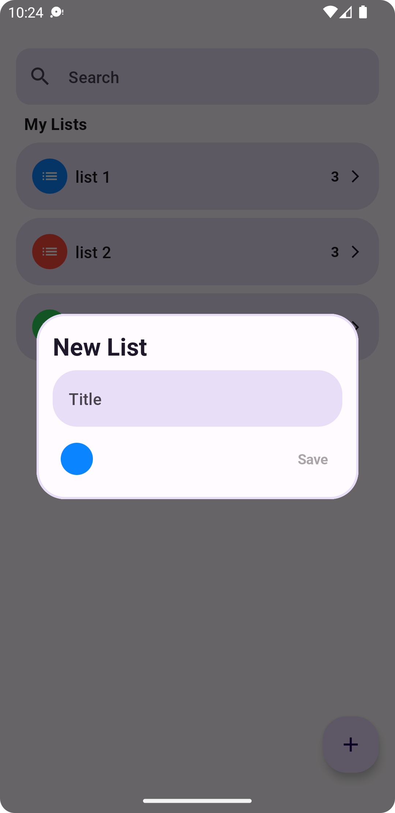
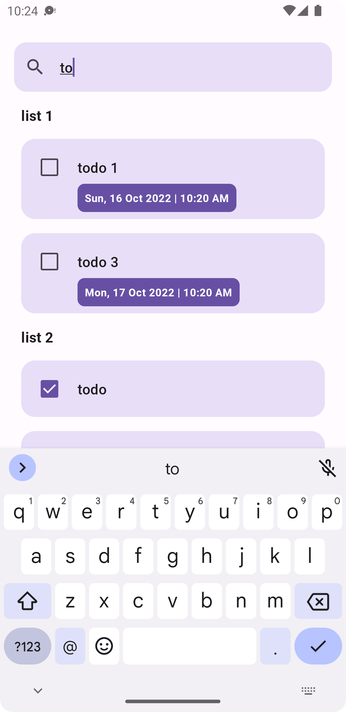

<h1 align="center">Tasks</h1>

 
Tasks is a todo app based on modern Android tech-stacks especially focus on Jetpack Compose UI using ktor server API.

## Tech stack & Open-source libraries
- 100% [Kotlin](https://kotlinlang.org/) based + [Coroutines](https://github.com/Kotlin/kotlinx.coroutines)
- [Hilt](https://developer.android.com/training/dependency-injection/hilt-android) - dependency injection library
- Flow
- JetPack
    - Compose - A modern toolkit for building native Android UI.
    - Lifecycle - dispose observing data when lifecycle state changes.
    - ViewModel - UI related data holder, lifecycle aware.
- Architecture
    - MVVM Architecture
    - Repository pattern
- Material Design
- [Accompanist](https://github.com/google/accompanist) - A collection of extension libraries for Jetpack Compose.

 

